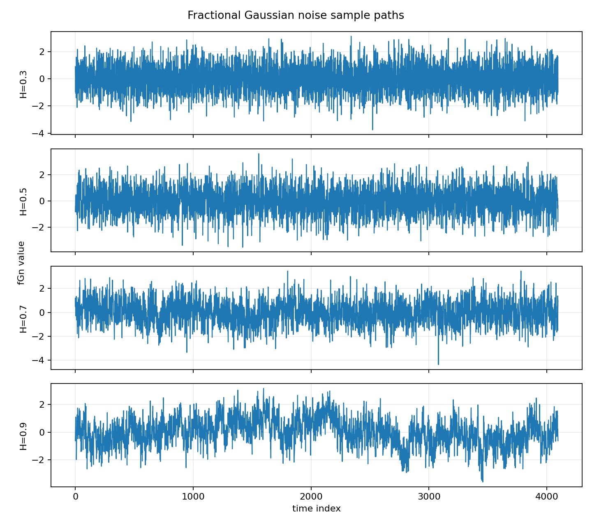
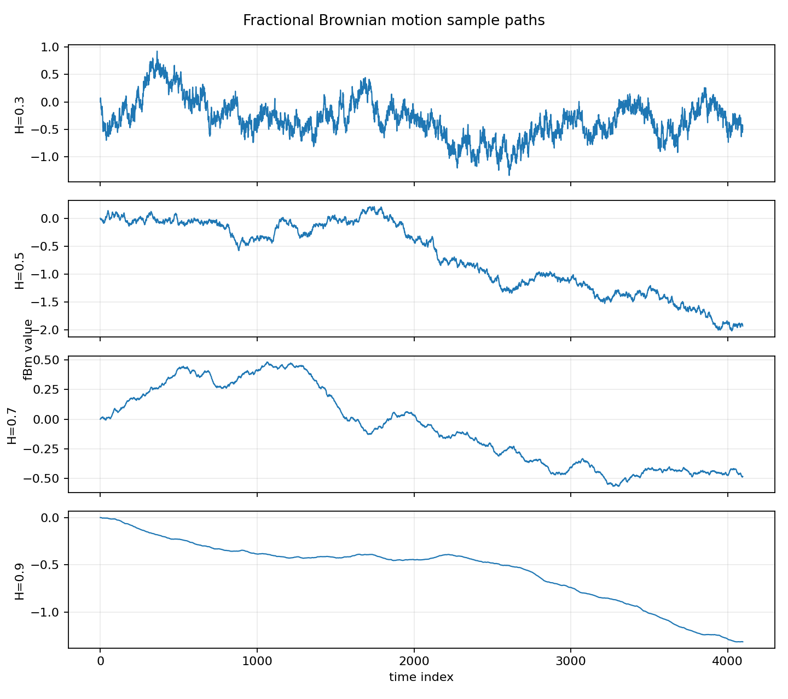
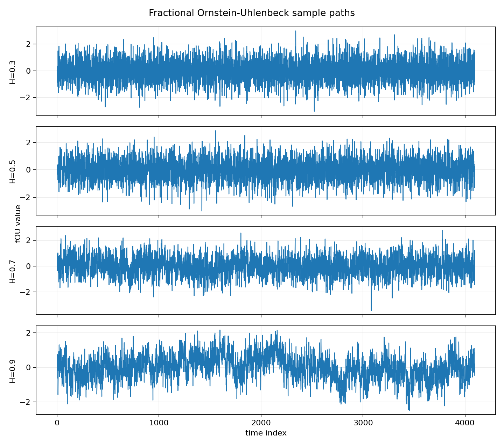
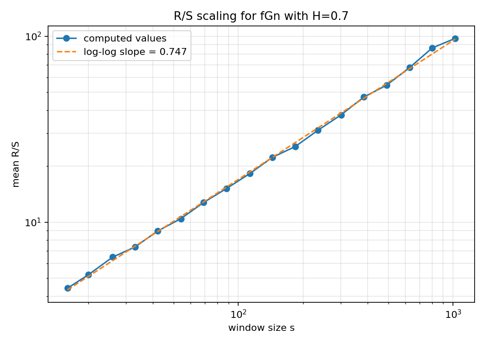
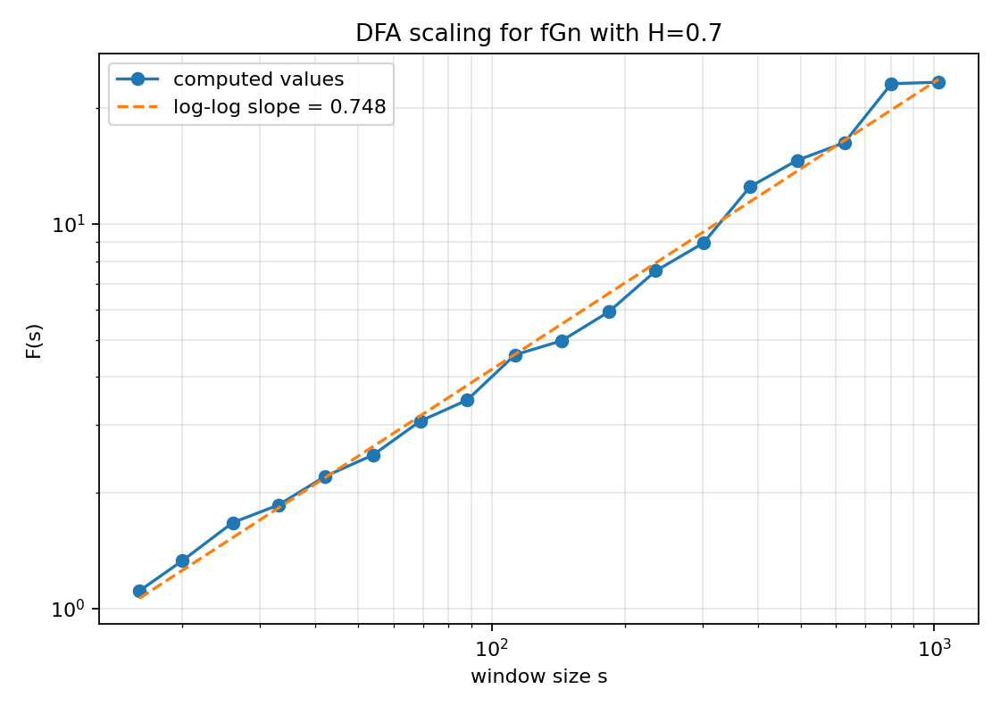
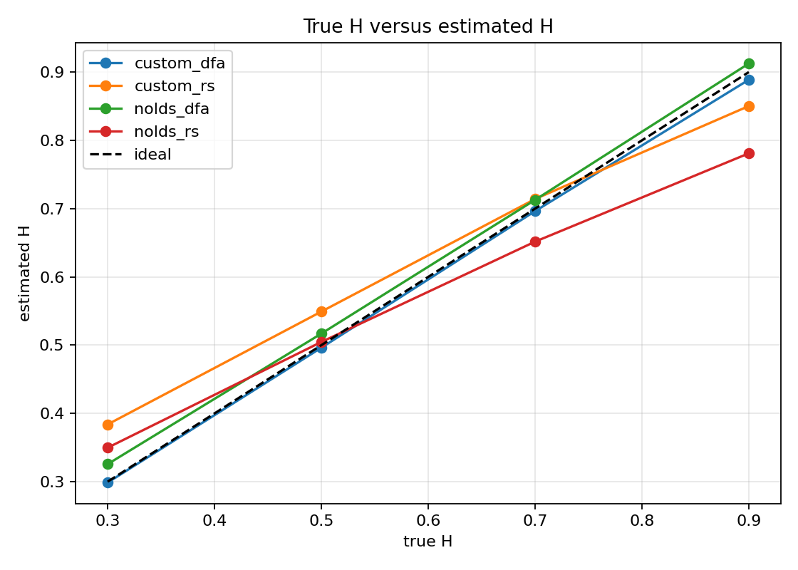
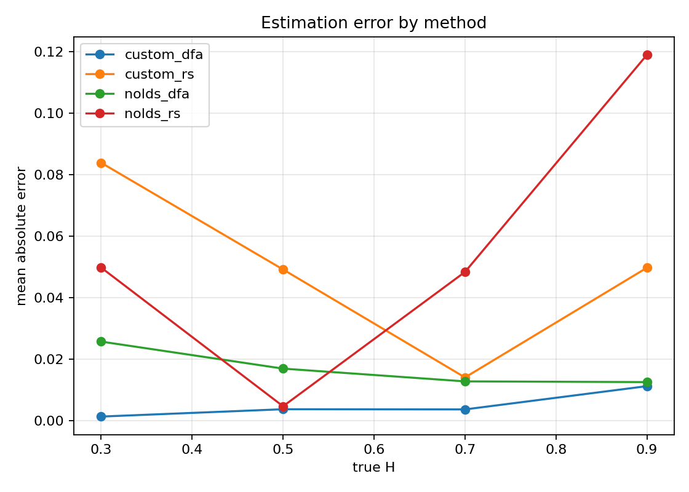
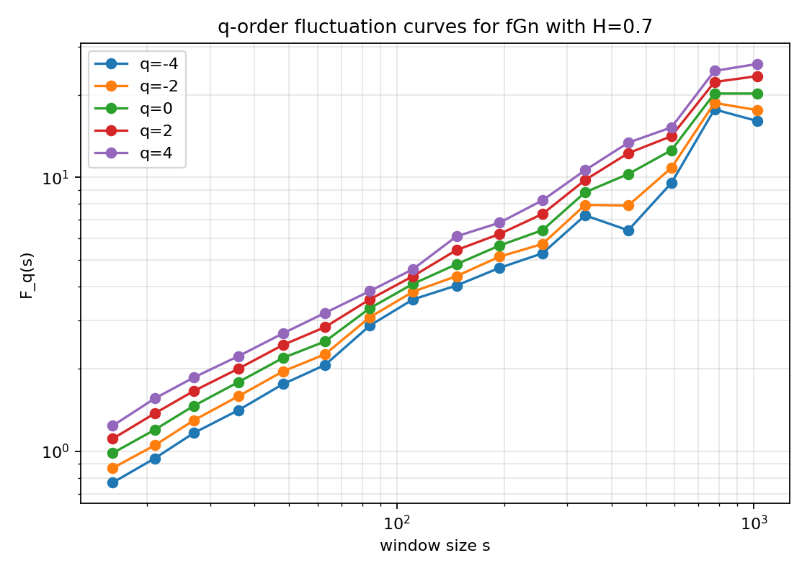

# Results Notes

## 1. Experiment that was run

Command:

```bash
python -m src.main
```

Default parameters:

```text
series length: 4096
custom estimator repeats per H: 100
nolds estimator repeats per H: 20
seed: 42
H values: 0.3, 0.5, 0.7, 0.9
```

Generated outputs:

```text
results/tables/hurst_estimates.csv
results/tables/hurst_estimates_raw.csv
results/figures/*.png
```

## 2. Current summary table

The current summary values are:

| H true | Method | Mean estimate | Std | Count | Absolute error |
|---:|---|---:|---:|---:|---:|
| 0.3 | custom_dfa | 0.2987 | 0.0225 | 100 | 0.0013 |
| 0.3 | custom_rs | 0.3839 | 0.0178 | 100 | 0.0839 |
| 0.3 | nolds_dfa | 0.3257 | 0.0108 | 20 | 0.0257 |
| 0.3 | nolds_rs | 0.3498 | 0.0134 | 20 | 0.0498 |
| 0.5 | custom_dfa | 0.4963 | 0.0311 | 100 | 0.0037 |
| 0.5 | custom_rs | 0.5492 | 0.0226 | 100 | 0.0492 |
| 0.5 | nolds_dfa | 0.5169 | 0.0174 | 20 | 0.0169 |
| 0.5 | nolds_rs | 0.5047 | 0.0186 | 20 | 0.0047 |
| 0.7 | custom_dfa | 0.6963 | 0.0390 | 100 | 0.0037 |
| 0.7 | custom_rs | 0.7141 | 0.0286 | 100 | 0.0141 |
| 0.7 | nolds_dfa | 0.7128 | 0.0161 | 20 | 0.0128 |
| 0.7 | nolds_rs | 0.6516 | 0.0246 | 20 | 0.0484 |
| 0.9 | custom_dfa | 0.8888 | 0.0454 | 100 | 0.0112 |
| 0.9 | custom_rs | 0.8503 | 0.0300 | 100 | 0.0497 |
| 0.9 | nolds_dfa | 0.9125 | 0.0227 | 20 | 0.0125 |
| 0.9 | nolds_rs | 0.7810 | 0.0277 | 20 | 0.1190 |

## 3. First interpretation

The estimates increase when the true `H` increases. This is the most important
basic check: the methods detect the correct direction of persistence.

Custom DFA is very accurate in this run:

- for `H = 0.3`, error is about `0.0013`;
- for `H = 0.5`, error is about `0.0037`;
- for `H = 0.7`, error is about `0.0037`;
- for `H = 0.9`, error is about `0.0112`.

Custom R/S is less accurate, especially at `H = 0.3` and `H = 0.5`, but it
still preserves the correct ordering of the Hurst exponent.

The `nolds` results are useful as a comparison, but they are based on fewer
repeats. Therefore, they should not be compared too aggressively with the custom
methods.

## 4. Autocorrelation diagnostic

The table also contains `lag1_acf_mean`. The observed behavior is consistent
with theory:

- for `H = 0.3`, lag-1 autocorrelation is negative;
- for `H = 0.5`, it is close to zero;
- for `H = 0.7`, it is positive;
- for `H = 0.9`, it is strongly positive.

This confirms that the generated fGn realizations behave like anti-persistent,
neutral, and persistent colored-noise processes.

## 5. Figure interpretation guide

`01_fgn_sample_paths.png`



- should show stationary colored-noise paths;
- higher `H` should create more visible persistence.

`02_fbm_sample_paths.png`



- should show fBm paths;
- higher `H` should look smoother and more slowly varying.

`03_fou_sample_paths.png`



- should show mean-reverting behavior;
- the process fluctuates but does not drift away like fBm.

`04_rs_loglog.png`



- should show the scaling relation for R/S;
- the slope of the fitted line is the R/S estimate.

`05_dfa_loglog.png`



- should show the scaling relation for DFA;
- the slope of the fitted line is the DFA estimate.

`06_true_vs_estimated_h.png`



- shows estimates compared with the ideal diagonal line;
- points closer to the diagonal mean more accurate estimates.

`07_estimation_error.png`



- compares absolute errors by method;
- useful for saying which method performed better in this experiment.

`08_multifractal_fluctuations.png`



- shows q-order fluctuation curves;
- different `q` values emphasize different fluctuation sizes.
